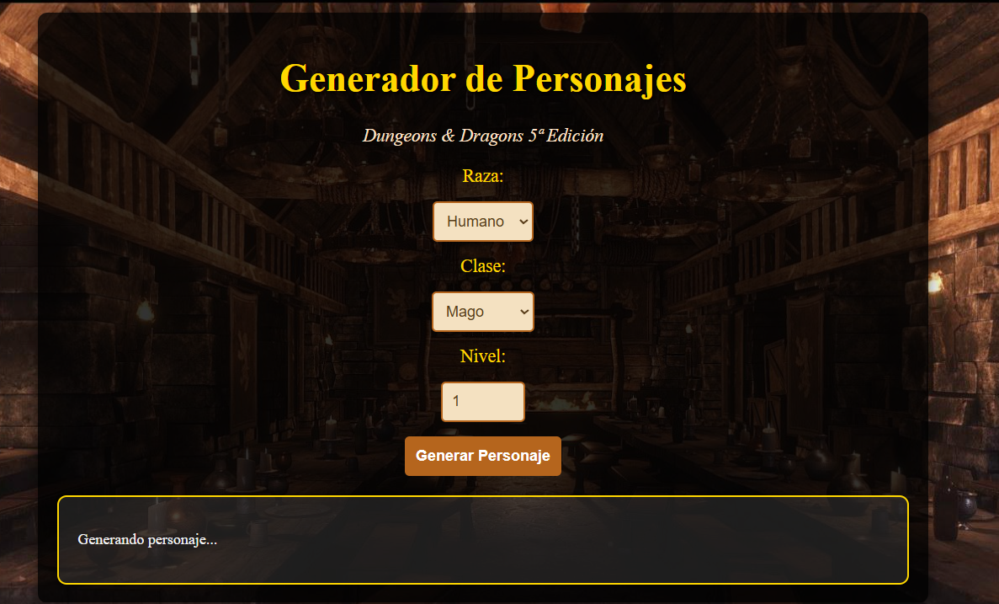
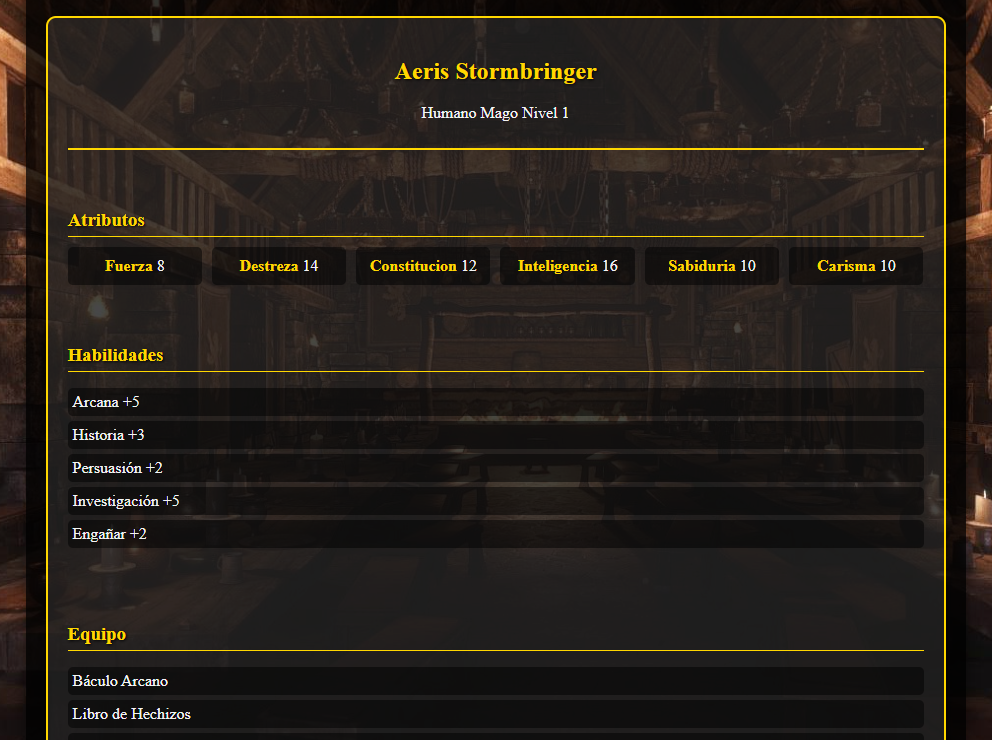

# Generador de Personajes D&D 5e

Un generador de fichas de personajes para **Dungeons & Dragons 5ª Edición** que utiliza la API de **OpenAI** para crear personajes detallados y únicos.



## 🚀 Características

- Genera personajes completos con **nombre, atributos, habilidades, equipo y trasfondo**.
- Permite personalizar por **raza, clase y nivel**.
- Interfaz estilo **D&D con ambientación de taberna**.
- Generación dinámica de contenido utilizando **inteligencia artificial**.

## 📋 Requisitos

- **Node.js** (v14 o superior)
- Cuenta en **OpenAI** con una API Key

## 🔧 Instalación

1. **Clona este repositorio:**
   ```bash
   git clone https://github.com/DarkChris11/generador-personajes-dnd.git
   cd generador-personajes-dnd
   ```
2. **Instala las dependencias:**
   ```bash
   npm install
   ```
3. **Configura la API Key de OpenAI:**
   - Crea un archivo **`.env`** en la raíz del proyecto.
   - Agrega tu clave de API de OpenAI:
     ```
     OPENAI_API_KEY=tu_clave_aqui
     ```
4. **Inicia el servidor:**
   ```bash
   node server.js
   ```
5. **Abre un navegador y ve a:** `http://localhost:3000`
6. **Selecciona raza, clase y nivel** del personaje que quieres generar.
7. **Haz clic en "Generar Personaje"** y espera a que se procese la solicitud.



## 🛠 Tecnologías utilizadas

- **Frontend:** HTML, CSS y JavaScript (Vanilla)
- **Backend:** Node.js con Express
- **API:** OpenAI (GPT-3.5 Turbo)

## 🎨 Personalización

Puedes personalizar el proyecto de varias maneras:

- Modifica **`styles.css`** para cambiar la apariencia visual.
- Ajusta el **prompt en `server.js`** para obtener diferentes tipos de personajes.
- Añade más opciones de **razas y clases en `index.html`**.

## 📌 Mejoras futuras

- ✅ Añadir más opciones de personalización (origen, género, etc.).
- ✅ Implementar guardado de personajes.
- ✅ Añadir exportación a **PDF**.
- ✅ Implementar sistema de **cuentas de usuario**.

## 📜 Licencia

Este proyecto está bajo la **Licencia MIT**. Consulta el archivo [LICENSE](LICENSE) para más detalles.

## 🎭 Agradecimientos

- La comunidad de **Dungeons & Dragons** por la inspiración.
- A todos los desarrolladores que contribuyen al proyecto (Yo). 🎲✨

---

💡 _"El dado está en tus manos, que los dioses del rol te acompañen."_ 🎲🔥